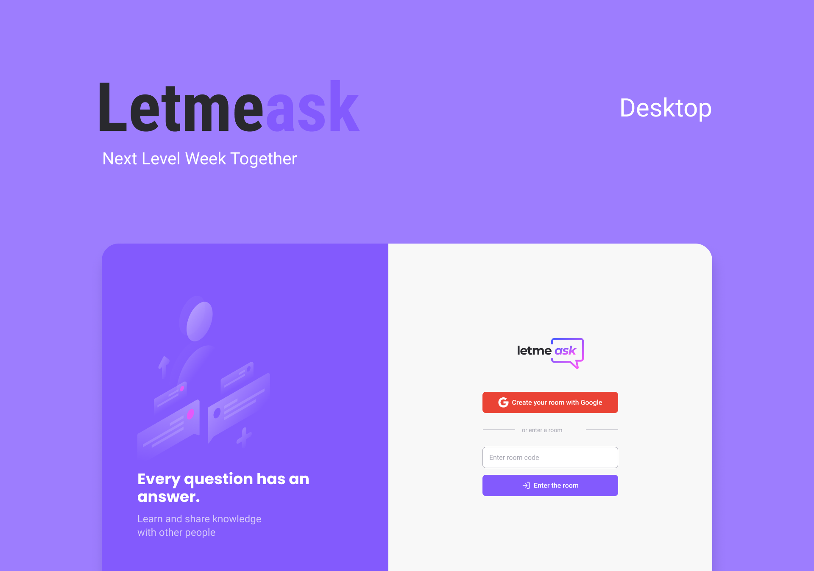

<div align="center">
  
  <pre>💭 Are you a content creator? Then <b>Letmeask</b> is perfect for you! <br>You can create Q&A rooms with the audience that follows you. 💭</pre>
</div>

## 💻 About the Project

**Letmeask** is a platform built to let you gather questions from your viewers during your stream and let them vote for which are the best questions for you to answer.

**Demo**: https://letmeask-b3a32.web.app/

Application built on the React JS track from Next Level Week NLW#06 from @rocketseat during June 20-24, 2021.

<div align="center"></div>

## 🛠️ Features

- [x] As a participant:
  - [x] Login with your Google account
  - [x] Create a new room
  - [x] Ask questions and submit
  - [x] Like the questions
  - [x] Button to copy room code
- [x] As room administrator:
  - [x] Can delete question
  - [x] You can close the room
  - [x] Answer the questions

## 🧪 Technologies

- [ReactJS](https://reactjs.org)
- [Node.js](https://nodejs.org/en/docs/guides/getting-started-guide/)
- [Firebase](https://firebase.google.com/)
- [TypeScript](https://www.typescriptlang.org/)
- [react-router-dom](https://reactrouter.com/web/guides/quick-start)
- [Sass](https://sass-lang.com/documentation)
- [React hooks](https://reactjs.org/docs/hooks-intro.html)

#### Added after

- [Styled-components](https://styled-components.com/docs/basics#installation)
- [Styled-react-modal](https://github.com/AlexanderRichey/styled-react-modal)

## ✅ Getting started

```bash
#Clone the project and access the folder.
$ git clone https://github.com/sestevao/letmeask.git
$ cd letmeask

# Install the dependencies
$ yarn

# Start the project
$ yarn start
```

The app will be available for access on your browser at http://localhost:3000

#### 📁 Config .ENV

added `.env.example` in the project, remember to add the environment variables as per the example

```
#FIREBASE
REACT_APP_API_KEY=
REACT_APP_AUTH_DOMAIN=
REACT_APP_DATABASE_URL=
REACT_APP_PROJECT_ID=
REACT_APP_STORAGE_BUCKET=
REACT_APP_MESSAGE_SENDING_ID=
REACT_APP_APP_ID=
```

## 🎨 Layout

You can view the project layout through this [link](https://www.figma.com/file/u0BQK8rCf2KgzcukdRRCWh/Letmeask/duplicate). You must have an account on Figma to access it.

## Additional functionalities

- [x] Add styled-components
- [x] Dark theme
- [x] Page not found/Not Found
- [x] Count of total questions, likes and answered questions
- [x] Direct/redirect to admin route after creating room
- [x] Create a Toast component from scratch to use at different times
- [x] Allow user to log out from the admin page and when viewing an open room
- [x] Add Page Not Found
- [ ] Route to display all rooms
- [ ] Allowing to order questions by the amount of likes on the room page
- [ ] Display a closed room, but without allowing the creation of questions and like

## 📝 License

This project is licensed under the MIT License. See the [LICENSE](LICENSE.md) file for details.

---

<p align="center"><sub>made with 💜 by sestevao</sub></p>
